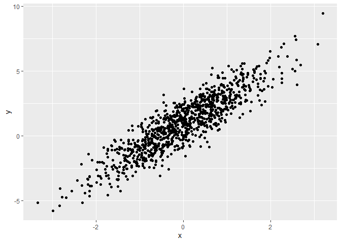
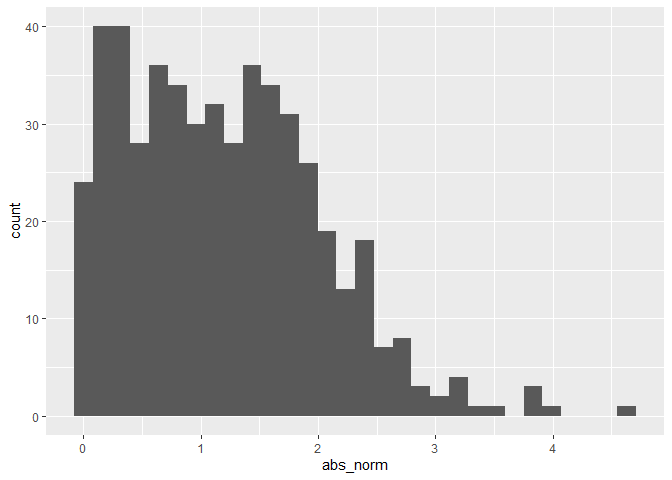

P8105 HW 1
================
Jennifer Mizhquiri

Generally speaking, you should in best practice load all packages you
will need. THis would help a reader know what is needed.

FYI Every time you knit a document it starts it from scratch. This is
considered best practice so you can catch errors. FYI it can come across
as an equation editor but it needs to be done better FYI CTRL ALT I is a
shortcut to create a code chunk FYI You can make bullets and tables –
see p8105

``` r
library(tidyverse)
```

    ## ── Attaching packages ─────────────────────────────────────── tidyverse 1.3.2 ──
    ## ✔ ggplot2 3.3.6      ✔ purrr   0.3.4 
    ## ✔ tibble  3.1.8      ✔ dplyr   1.0.10
    ## ✔ tidyr   1.2.0      ✔ stringr 1.4.1 
    ## ✔ readr   2.1.2      ✔ forcats 0.5.2 
    ## ── Conflicts ────────────────────────────────────────── tidyverse_conflicts() ──
    ## ✖ dplyr::filter() masks stats::filter()
    ## ✖ dplyr::lag()    masks stats::lag()

I’m an R Markdown document!

# Section 1

Here’s a **code chunk** that samples from a *normal distribution*:

``` r
#####it is not good practice to comment unless very complex###

samp = rnorm(100)
length(samp)
```

    ## [1] 100

# Section 2

I can take the mean of the sample, too! The mean is -0.1848418. Above
you see an example of how to do in-line code.

Often, this is used for reporting number of observations / rows in a
datset which can change as the data is being tidied.

# Section 3

Find out what was included near section 3

This makes a plot. First I generate a data frame then I use ggplot.

``` r
plot_df = 
  tibble(
    x = rnorm(n = 1000),
    y = 1 + 2 * x + rnorm(n = 1000)
  )

ggplot(plot_df, aes(x = x, y = y)) + geom_point()
```

<!-- -->

This makes it so you don’t run the code (helpful if you want to document
for some reason)

``` r
ggplot(plot_df, aes(x = x)) + geom_histogram()
```

This suppresses the messages that pop up
<!-- -->

You can name your code chunk. Not necessarily recommended. This is
helpful since R markdown will keep track. Click render to see the log.
Helpful for problem solving. Don’t repeat names.

you can combine the name and the command
<!-- -->

# Section 4

Write a named code chunk that creates a dataframe comprised of: a
numeric variable containing a random sample of size 500 from a normal
variable with mean 1; a logical vector indicating whether each sampled
value is greater than zero; and a numeric vector containing the absolute
value of each element. Then, produce a histogram of the absolute value
variable just created. Add an inline summary giving the median value
rounded to two decimal places. What happens if you set eval = FALSE to
the code chunk? What about echo = FALSE?

<!-- -->
