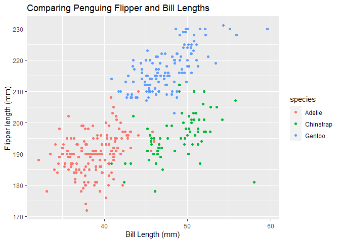

P8105 HW 1
================
Jennifer Mizhquiri

The following package will be necessary:

``` r
library(tidyverse)
```

# Problem 1

    ## # A tibble: 6 × 8
    ##   species island    bill_length_mm bill_depth_mm flipper_l…¹ body_…² sex    year
    ##   <fct>   <fct>              <dbl>         <dbl>       <int>   <int> <fct> <int>
    ## 1 Adelie  Torgersen           39.1          18.7         181    3750 male   2007
    ## 2 Adelie  Torgersen           39.5          17.4         186    3800 fema…  2007
    ## 3 Adelie  Torgersen           40.3          18           195    3250 fema…  2007
    ## 4 Adelie  Torgersen           NA            NA            NA      NA <NA>   2007
    ## 5 Adelie  Torgersen           36.7          19.3         193    3450 fema…  2007
    ## 6 Adelie  Torgersen           39.3          20.6         190    3650 male   2007
    ## # … with abbreviated variable names ¹​flipper_length_mm, ²​body_mass_g

A preview of the *penguins* dataset is displayed above. It contains
geographic and demographic data on individual penguins belonging to
different species of penguins. There are 344 rows and 8 columns: species
(species), island (island), bill_length_mm (bill length in mm),
bill_depth_mm (bill depth in mm), flipper_length_mm (flipper length in
mm), body_mass_g (body mass in grams), sex (sex), and year (year). From
here, summary statistics could be extracted. The mean flipper length is
200.9152047 mm. The mean bill length is 43.9219298 mm.

*Scatterplot Comparing Bill and Flipper Lengths in Penguins*
<!-- -->

On average, Gentoo sp. have longer bills and flipper lengths than Adelie
and longer flippers and approximately equal bill lengths as the
Chinstrap species. Adelie species have shorter bill lengths and smaller
flipper lengths on average relative to the Chinstrap species (though
outliers are present and the average difference does not appear large).
Chinstrap have bill lengths about as long as the Gentoo species but
shorter flipper lengths.

# Problem 2

    ## # A tibble: 10 × 4
    ##    var_rand var_logic var_char var_factor
    ##       <dbl> <lgl>     <chr>    <ord>     
    ##  1    0.314 TRUE      a        a         
    ##  2    0.690 TRUE      b        b         
    ##  3   -0.591 FALSE     c        c         
    ##  4   -0.643 FALSE     a        a         
    ##  5   -1.34  FALSE     a        a         
    ##  6   -0.383 FALSE     b        b         
    ##  7   -0.519 FALSE     b        b         
    ##  8   -1.82  FALSE     c        c         
    ##  9   -0.622 FALSE     b        b         
    ## 10   -1.42  FALSE     a        a

Above is a dataframe comprised of:

-   a random sample of size 10 from a standard Normal distribution
-   a logical vector indicating whether elements of the sample are
    greater than 0
-   a character vector of length 10
-   a factor vector of length 10, with 3 different factor “levels”
    -   Note: this factor vector is a factor version of the character
        version, but has assigned levels to each of the possible values

*Below is a code chunk demonstrating how variables may be pulled.*

``` r
var_rand_pull <- sample_df %>% pull(var_rand) 
var_logic_pull <- sample_df %>% pull(var_logic)
var_char_pull <- sample_df %>% pull(var_char)
var_factor_pull <- sample_df %>%  pull(var_factor)
```

*What happens when you take the mean of each variable?*

-   The mean of var_rand is -0.634112
    -   It makes sense that there is a mean as the variable is a numeric
        one. The mean is expected to also be close to 0.
-   The mean of var_logic is 0.2
    -   It makes sense that there is an available mean as R interprets
        “True” as 1 and “False” as 0, indicating that with a number
        closer to 0 there are more instances of “False” and vice versa.
-   The mean of var_char is NA.
    -   It makes sense that there is no available mean as the variable
        is that of a character and as such it is not applicable.
-   The mean of var_factor is NA
    -   It makes sense that there is no available mean as the variables
        are made up of levels but even so it is not numeric.

*What happens when you try to explicitly convert a factor, character,
and logical character to a numeric one?*

``` r
var_char_num <- as.numeric(var_char_pull)
var_factor_num <- as.numeric(var_factor_pull)
var_logic_num <- as.numeric(var_logic_pull)
```

R will provide a warning message noting that NAs are introduced by
coercion for a character variable.

-   This makes sense as R does not have a basis for ascribing a numeric
    value to the characters, which is why you still yield an NA, and
    furthermore why it was not possible (nor logical in this instance)
    to have a mean. Rather, the mean appeared as NA.

No such warning messages appeared for the formerly logical and factor
variables.

-   In the case of the logical variable, I would expect the same mean to
    appear (a numeric mean was produced before the logical variable was
    coerced into numeric, as described above. In the case of the factor
    variable, the coercion to numeric variable meant that each of the
    levels of 1,2,3 were interpreted as numeric and the average of that
    collection would now be able to be calculated.
