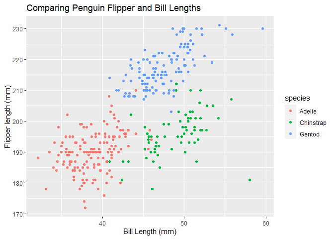

P8105 HW 1
================
Jennifer Mizhquiri

The following packages are being used:

``` r
library(tidyverse)
library(dplyr)
```

# Problem 1

    ## # A tibble: 6 × 8
    ##   species island    bill_length_mm bill_depth_mm flipper_l…¹ body_…² sex    year
    ##   <fct>   <fct>              <dbl>         <dbl>       <int>   <int> <fct> <int>
    ## 1 Adelie  Torgersen           39.1          18.7         181    3750 male   2007
    ## 2 Adelie  Torgersen           39.5          17.4         186    3800 fema…  2007
    ## 3 Adelie  Torgersen           40.3          18           195    3250 fema…  2007
    ## 4 Adelie  Torgersen           NA            NA            NA      NA <NA>   2007
    ## 5 Adelie  Torgersen           36.7          19.3         193    3450 fema…  2007
    ## 6 Adelie  Torgersen           39.3          20.6         190    3650 male   2007
    ## # … with abbreviated variable names ¹​flipper_length_mm, ²​body_mass_g

A preview of the *penguins* dataset is displayed above. It contains
geographic and demographic data on individuals belonging to different
species of penguins. There are 344 records and 8 variables: species,
island, bill_length_mm, bill_depth_mm, flipper_length_mm, body_mass_g,
sex, and year.

The mean flipper length is 200.9152047 mm

``` r
ggplot(penguins, aes(x = bill_length_mm, y = flipper_length_mm, color = species)) + geom_point() + xlab("Bill Length (mm)") + ylab("Flipper length (mm)") + ggtitle("Comparing Penguin Flipper and Bill Lengths")
```

<!-- -->

``` r
ggsave("BillxFlipperLengthxSpecies.PDF", height = 4, width = 10)
```

On average, Gentoo sp. have longer bills and flipper lengths than Adelie
and Chinstrap species. Adelie species have shorter bill lengths and
smaller flipper lengths on average relative to the Chinstrap species
(though outliers are present and the average difference does not appear
large). Chinstrap have bill lengths about as long as the Gentoo species
but shorter flipper lengths.

# Problem 2

    ## # A tibble: 10 × 4
    ##    var_rand var_logic var_char var_factor
    ##       <dbl> <lgl>     <chr>    <ord>     
    ##  1   -0.730 FALSE     a        a         
    ##  2   -0.382 FALSE     b        b         
    ##  3   -0.925 FALSE     c        c         
    ##  4   -1.88  FALSE     a        a         
    ##  5    1.29  TRUE      a        a         
    ##  6    0.495 TRUE      b        b         
    ##  7   -2.10  FALSE     b        b         
    ##  8    0.193 TRUE      c        c         
    ##  9    0.632 TRUE      b        b         
    ## 10    1.72  TRUE      a        a

Above is a dataframe comprised of:

-   a random sample of size 10 from a standard Normal distribution
-   a logical vector indicating whether elements of the sample are
    greater than 0
-   a character vector of length 10
-   a factor vector of length 10, with 3 different factor “levels”

``` r
var_rand_pull <- sample_df %>% pull(var_rand) 
var_logic_pull <- sample_df %>% pull(var_logic)
var_char_pull <- sample_df %>% pull(var_char)
var_factor_pull <- sample_df %>%  pull(var_factor)
```

*What happens when you take the mean of each variable?*

-   The mean of var_rand is -0.1686783
    -   It makes sense that there is a mean as the variable is a numeric
        one. The mean is expected to also be close to 0.
-   The mean of var_logic is 0.5
    -   It makes sense that there is an available mean as R interprets
        “True” as 1 and “False” as 0, indicating that with a mean of
        0.3, there are more instances of “False”.
-   The mean of var_char is NA.
    -   It makes sense that there is no available mean as the variable
        is that of a character and as such it is not applicable.
-   The mean of var_factor is NA
    -   It makes sense that there is no available mean as the variables
        are made up of levels but even so it is not numeric.

*What happens when you try to take the means of a character and factor
variable, respectively, by setting them to numeric variables?*

The mean of a factor variable by coercion to a numeric variable is 1.8.
\* Note: R has interpreted the levels as 1, 2, 3 and has now taken the
average of each instance.

The mean of a character variable by coercion to a numeric variable is NA
\* Note: R does not have a basis for ascribing a numeric value to the
characters, which is why you still yield an NA.
